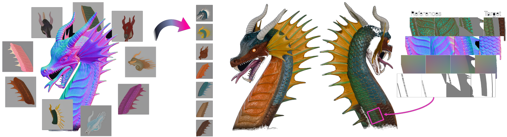

<div align="center">

# GLOSS

### Geometric Local Self-Similarity Learning for Faithful Reference-Guided Texture Fill

[](https://chenyuecai.github.io/gloss-page/)
[](https://chenyuecai.github.io/gloss-page/assets/paper/gloss.pdf)
[](https://asia.siggraph.org/2026/)

[**Chenyue Cai**](https://chenyue-cai.com/)<sup>1\*</sup> · **Anita Hu**<sup>2</sup> · [**James Lucas**](https://www.cs.toronto.edu/~jlucas/)<sup>2</sup> · [**Szymon Rusinkiewicz**](https://www.cs.princeton.edu/~smr/)<sup>1</sup> · [**Masha Shugrina**](https://shumash.com/)<sup>2</sup>

<sup>1</sup> Princeton University&nbsp;&nbsp;·&nbsp;&nbsp;<sup>2</sup> NVIDIA

<sub><sup>\*</sup> Work done during an internship at NVIDIA</sub>



</div>

---

## 🌐 Project Page

Interactive demos, turntables and full results: **[chenyuecai.github.io/gloss-page](https://chenyuecai.github.io/gloss-page/)**

## 📜 News

- **[TODO]** Release training code, model checkpoints, and the Blender add-on.
- **[2026-07-18]** GLOSS is accepted to SIGGRAPH Asia 2026! 🎉

## 📝 Citation

```bibtex
@inproceedings{cai2026gloss,
  title     = {GLOSS: Geometric Local Self-Similarity Learning for
               Faithful Reference-Guided Texture Fill},
  author    = {Cai, Chenyue and Hu, Anita and Lucas, James and
               Rusinkiewicz, Szymon},
  booktitle = {SIGGRAPH Asia 2026 Conference Papers},
  year      = {2026},
  doi       = {10.1145/3829340.3842197}
}
```
